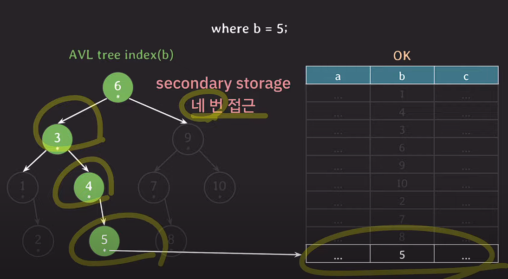
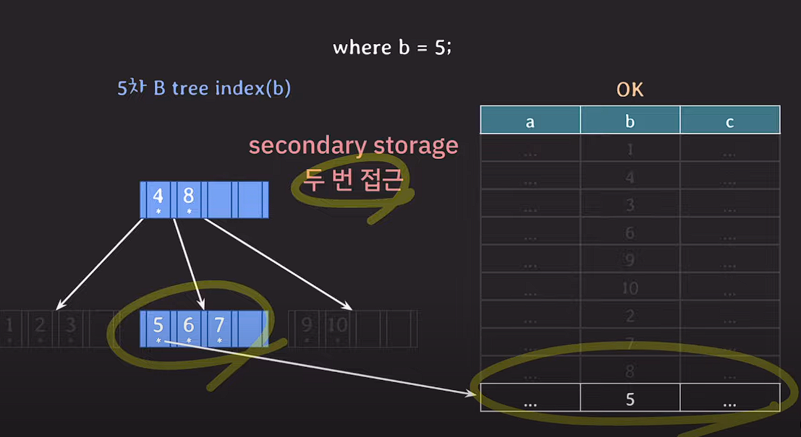

# DB index 자료구조를 B Tree를 쓰는이유  

## DB는 보조 기억장치에 있다.
db는 보조 기억장치에 있다. 우리가 데이터를 읽고 사용하기 위해서는 db에 접근해서 데이터를 메모리에 올려 비로소 데이터를 사용할 수 있게 된다.

하지만 보조기억장치에 접근해서 데이터를 가져오는건 속도가 느리다. 고로 db 접근을 최대한 적게 하는게 성능면에서 좋다.

보조기억장치는 데이터를 block 단위로 데이터를 읽고 쓴다.

block이란 file system이 데이터를 읽고 쓰는 논리적인 단위이다. 2의 승수로 읽기 때문에 (2kb, 4kb, 8kb ..) 당장 필요하지 않는 데이터도 딸려 올 수 있다.

이 점에서 AVL Tree index와 B Tree index를 비교하여 왜 db index를 B Tree를 사용하는지 알아보자

## AVL Tree

AVL Tree는 이진 탐색 트리다. 이진 탐색 트리는 자식 노드를 1~2개 밖에 가지지 못한다.

그렇기 때문에 where b = 5라는 작업을 할 때 db에 4번 접근하게 되는 그림이다.
## B Tree

반면, B Tree의 경우 n차 B tree를 통해 자식 노드를 여러개를 가질 수 있기에 block 단위로 

데이터를 퍼올리는 보조기억장치 특성상
B Tree를 활용하는 것이 db 접근을 최소화 시켜 성능을 극대화 시킬 수 있다.
## 결론
B Tree의 여러 자식노드를 가질 수 있는 특성으로 인해 대부분의 경우 db index의 자료구조는 B Tree를 사용한다.

출처 https://www.youtube.com/watch?v=liPSnc6Wzfk