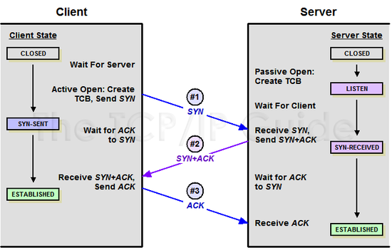

# TCP와 UDP 차이

## TCP
TCP는 `연결 지향적` 프로토콜이다. 즉, 클라이언트와 서버가 연결된 상태에서 데이터를 주고 받는 프로토콜을 의미한다.

### 특징
 1. 연결형 서비스로 가상 회선 방식을 제공
    - 3-way handshaking 과정을 통해 연결하고
    - 4-way handshaking 과정을 통해 연결을 해제함
 2. 흐름 제어
    - 데이터 처리 속도를 조절하여 수신자의 버퍼 오버플로우를 방지
 3. 혼잡제어
    - 네트워크 내의 패킷 수가 과도하게 증가하지 않도록 방지
 4. 높은 신뢰성 보장
    - 신뢰성이 높은 전송을 하기 때문에 UDP 보다 속도가 느리다.
### TCP의 연결과정 (3-way handshake)
1. Client -> Server : 내 말 들려? (SYN)
2. Server -> Client : 어 잘 들려 내 말은 들려? (SYN + ACK)
3. Client -> Server : 잘 들려! (ACK)

SYN(synchronize sequence numbers) - 연결 확인을 보내는 무작위 숫자값
ACK(acknowledgements) - Client 혹은 Server로 부터 받은 SYN에 1을 더해 SYN을 잘 받았다는 ACK

### TCP의 연결 해제 과정 (4-way handshake)
1. Client -> Server : 이제 끊자~
2. Server -> Client : 알겠어 잠깐만!
3. Server -> Client : 나도 끊을게!
4. Client -> Server : 알겠어!

## UDP

UDP는 `비연결형 프로토콜`이다. 연결을 위해 할당되는 논리적인 경로가 없고, 각각의 패킷은 다른 경로로 전송되며, 독립적인 관계를 지닌다.

### 특징

1. 비연결형 서비스로 데이터그램 방식을 제공한다.
   - 데이터의 전송 순서가 바뀔 수 있다.
2. 데이터 수신 여부를 확인하지 않는다.
   - TCP의 3-way handshaking 같은 과정 X
3. 신뢰성이 낮다.
   - 흐름제어가 없어서 제대로 전송되었는지, 오류가 없는지 확인할 수 없다
4. TCP보다 속도가 빠르다

## 정리
TCP는 연속성보다 신뢰성 있는 전송이 중요할떄 사용한다

UDP는 TCP보다 빠르고 네트워크 부하가 적다는 장점이 있지만, 신뢰성 있는 데이터 전송을 보장하지는 않는다.
그렇기 때문에 신뢰성보다는 연속성이 중요한 스트리밍과 같은 서비스에 사용된다.