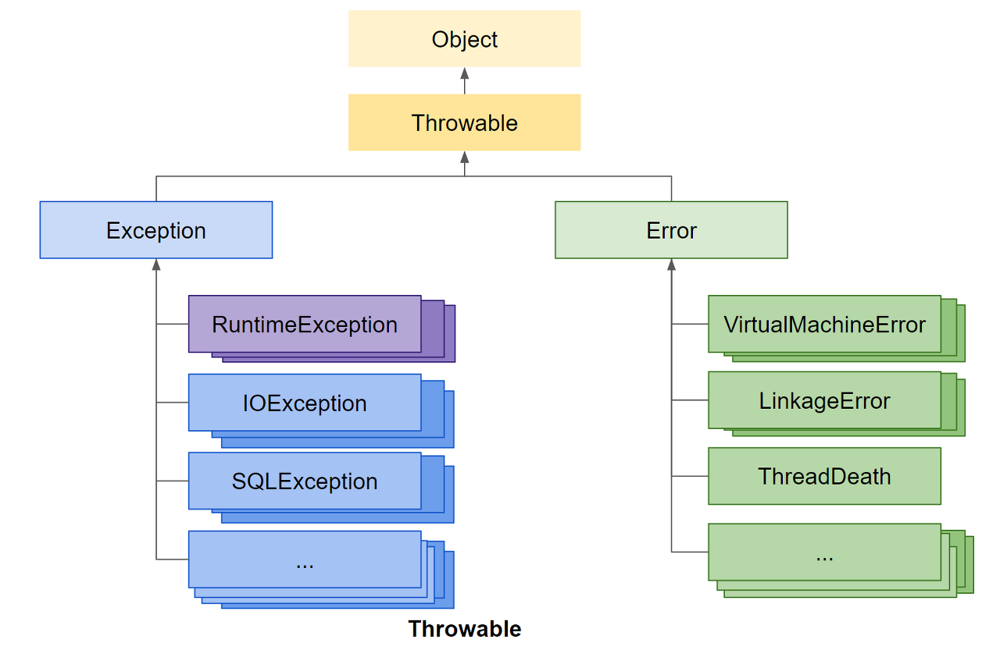

# Checked Exception과 UnChecked Exception과 Error

우선 들어가기전에 Exception과 Error에 차이점을 알아보고 가자



## Error와 Exception 차이
프로그램이 실행 중 어떤 원인에 의해서 오작동하거나 비정상 종료하는 경우가 있다. 이러한 경우는
에러 또는 오류라고 한다. 발생 시점은 아래와 같이 세 가지로 나눈다.
1. 컴파일 에러 : 컴파일 시 발생하는 에러
2. 런타임 에러 : 실행 시에 발생하는 에러
3. 논리적 에러 : 실행은 되지만, 의도와 다르게 동작하는 것

컴파일 에러는 컴파일 할 때 발생하는 에러이고, 프로그램 실행 도중 발생하는 에러를 런타임 에러라고 한다. 논리적 에러는 컴파일도 잘되고
실행도 잘되지만 개발자가 의도한 것과 다르게 동작한 경우를 말한다. 

자바에서는 실행 시(runtime) 발생할 수 있는 프로그램의 오류를 '에러(Error)'와 '예외(Exception)'로 구분했다.

- 예외(Exception): 입력 값에 대한 처리가 불가능하거나, 프로그램 실행 중에 참조된 값이 잘못된 경우 등 정상적인 프로그램의 흐름을 어긋나는 것
- 에러(Error): OutOfMemoryError, StackOverflowError와 같이 발생하면 복구할 수 없는 심각한 오류

에러가 발생하면 프로그램의 비정상적인 종료를 막을 길이 없지만,예외는 발생하더라도 프로그래머가 이에 대한 적절한 코드를 미리 작성해 놓음으로써 프로그램의 비정상적인 종료를 막을 수 있다.

## Checked Exception
```java
class Exception {
	public static void main(String[] args) {
		throw new Exception();
	}
}
```

- Checked Exception은 컴파일러가 체크하는 예외로, 메소드에서 발생할 수 있는 예외를 미리 예측하고 처리하도록 "강제" 한다.
- 즉, 메소드에서 해당 예외를 던지거나 try-catch 블록을 통해 예외를 처리하도록 요구한다.(컴파일 조차 안된다.)
- 예를 들어, FileNotFoundException, IOException등이 이에 해당한다. 파일을 읽거나 쓸 때 발생할 수 있는 IOException은 Checked Exception의 예시.

## UnChecked Exception
```java
class Exception {
	public static void main(String[] args) {
		throw new RuntimeException();
	}
}
```
- Unchecked Exception은 컴파일러가 체크하지 않는 예외로, RuntimeException 클래스와 그 하위 클래스들을 포함한다.
- 이 예외들은 개발자의 실수에 의해 발생하거나 더 이상 프로그램의 실행을 계속할 수 없는 상황에서 발행한다. 대표적으로  NullPointerException, ArrayIndexOutOfBoundsException, IllegalArgumentException 등이 있다.
- RuntimeException클래스와 그 자손들에 해당하는 예외는 프로그래머에 의한 실수로 발생하는 것들이기 때문에 예외처리를 강제하지 않는다. 따라서 Unchecked Excetpion이라고 불리는 것.

## Error
- 에러는 일반적으로 프로그램이 심각한 문제를 직면했을 때 발생한다. 에러는 시스템 레벨의 문제로 인해 발생하며, 대부분 프로그램 코드에서 직접적으로 처리할 수 없다.
- OutOfMemoryError, StackOverFlowError 등이 대표적
- 에러는 예외와는 달리 프로그램 코드에서 복구할 수 없는 상태에 도달했을 때 발생하므로, 보통 예외 처리기를 사용하여 처리하지 않는다. 일반적으로 시스템 자원이나 구성에 대한 수정이 필요함.