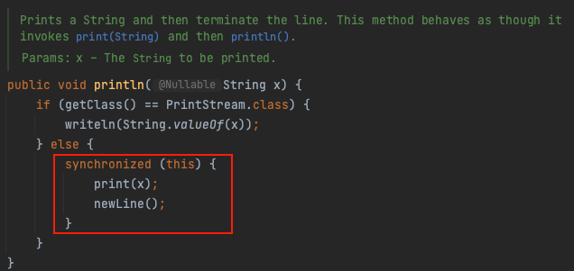

실무에서는 System.out.println으로 로그를 찍으면 안된다고 한다.

그 이유는
 - 성능 이슈
   - 블로킹 I/O로 동작하고 멀티쓰레드에서 락이 발생하기 때문이다. 즉, System.out.println이 실행될때마다 대기 해야하기에 성능 저학가 발생할 수 있다.
 - 로그 레벨 관리가 어려움
   - 로그 레벨을 지정할 수 없기 때문에(info, debug, error, warn) 디버깅 용도로 사용되는 경우, 어떤 로그 레벨로 출력되는지 확인하기 어려움.

println 메소드를 들어가서 보면 다음과 같이 구현되어 있다.

synchronized 때문에 thread-safe하게 동작한다.