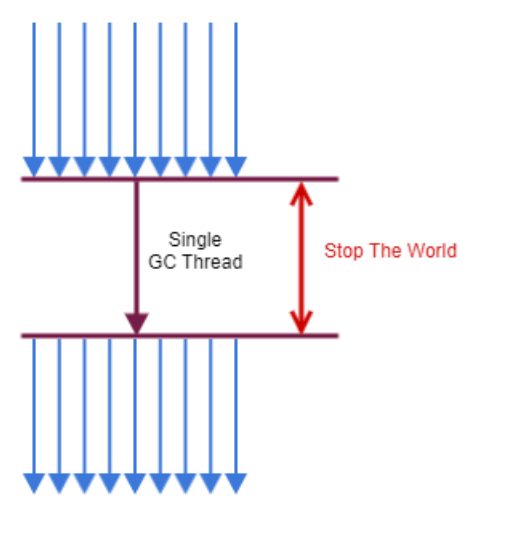
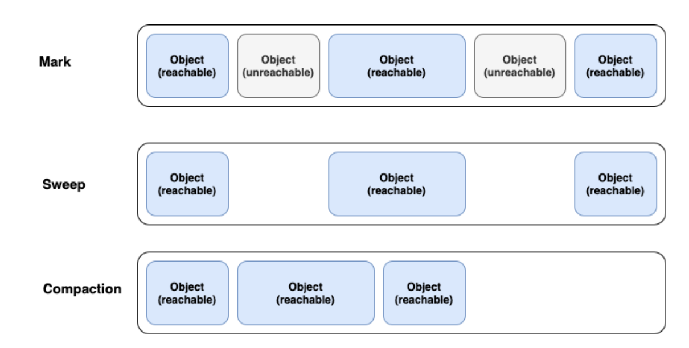

# Garbage Collection 이란?
가비지 컬렉션은 자바의 메모리 관리 방법 중의 하나로 JVM의 Heap 영역에서 동적으로 할당됐던 메모리 중 더 이상 사용되지 않는 객체를 모아 주기적으로 제거하는 프로세스이다.
C/C++ 에서는 이러한 가비지 컬렉션이 없어 프로그래머가 수동으로 메모리 할당과 해제를 해줘야 했다.

반면 java에서는 가비지 컬렉터가 메모리 관리를 수행해주기 때문에 java 프로세스가 한정된 메모리를 효율적으로 사용할수 있게 하고 개발자 입장에서 메모리 관리,
메모리 누수 문제에 대해 관리하지 않아도 되어 개발에만 집중할 수 있다는 장점이 있다.

메모리를 관리해주는 언어를 매니지드 언어라고 하며 개발자가 메모리룰 관리하는 언어를 언매니지드 언어라고도 한다.

가비지 컬렉션이 동작하는 동안에는 다른 동작을 멈추기 때문에 오버헤드가 발생되는 문제점이 있다.
이를 **Stop The World** 라 한다.

GC튜닝이라 하는 작업들은 이 Stop the world를 줄이는 것을 의미한다.

## Stop the world를 하는 이유
### 메모리 파편화(Memory fragmentation)

컴퓨터 시스템에서 메모리 공간을 할당하고 해제하는 과정에서 발생하는 현상이다. 메모리 파편화는 크게 외부 파편화와
내부 파편화로 나뉘는데 외부 파편화는 메모리 공간이 여러 개의 작은 조각으로 나누어져 사용되어, 충분한 메모리 공간이 있음에도 불구하고
큰 메모리 블록을 할당할 수 없는 경우를 말한다.

반면, 내부 파편화는 메모리 공간 중 일부가 할당된 뒤 남는 공간이 발생하는 경우이다. 예를 들어, 8byte의 메모리 블록이
할당 되었는데 10 byte 공간으로 할당 받았다면 2byte의 내부 파편화가 발생한다. 즉 메모리 파편화는 메모리를 효율적으로
사용하는데 있어 치명적으로 작용한다.

GC 또한 할당 된 메모리를 해제 하는 과정에서 메모리 공간이 새로 남는데 이를 해결하기 위해서 Compaction이 일어나야한다.
즉 힙 영역 내의 빈 공간들을 큰 블록으로 만들고 다시 이용할 수 있는 상태로 만들어야하는데 이를 위해 객체를 새로운 주소로
이동 시키고 다시 주소를 참조할 수 있게 해줘야 한다. 그렇기 때문에 stop the world가 발생한다.

### 객체 일관성

가비지 컬렉터가 더 이상 사용허지 않는 객체를 탐지하고 수집하는 작업을 수행하는데, 이 과정에서 메모리 내의 객체들의 상태가 변경 될 수 있고 다른 스레드가 객체를 참조할 수도 있다.
이로서 잘못된 결과나 의도치 않은 오류를 낼 수도 있다. 예를 들어 가비지 컬렉터가 수집하는 객체를 스레드가 동시에 참조한다면 나중에 다시 호출했을 때 이미 객체는
수집되서 존재하지 않기 때문에 예기치 못한 오류를 발생 시킬 수 있다.

## 가비지 컬렉션 대상

Reachable: 객체가 참조되고 있는 대상

Unreachable: 객체가 참조되고 있지 않는 상태(GC 대상)

## 가비지 컬렉션 청소 방식

### Mark And Sweep
Mark-Sweep 이란 다양한 GC에서 사용되는 객체를 솎아내는 알고리즘이다.  가비지 컬렉션이 동작하는 기초적인 청소과정.

가비지 컬렉션이 될 대상 객체를 식별(Mark)하고 제거(Sweep)하며 객체가 제거되어 파편화된 메모리 영억을 앞에서부터 채워 나가는 

작업(Compaction)을 수행하게 된다.

Mark : 어떤 객체를 참조하고 있는지 찾아서 마킹한다.

Sweep : 참조하고 있지 않는 객체들을 Heap에서 제거한다.

Compact : Sweep 후에 분산된 객체들을 Heap의 시작 주소로 모아 메모리가 할당된 부분과 그렇지 않는 부분으로 압축한다.(가비지 컬렉터 종류에 따라 하지 않는 경우도 있다.)

# 2. 가바지 컬렉션 동작 과정
## heap 메모리의 구조
### young 영역
 - 새롭게 생성된 객체가 할당 되는 영역
 - 대부분의 객체가 금방 Unreachable 상태가 되기 때문에, 많은 객체가 young 영역에 생성되었다가 사라진다.
 - young 영역에 대한 가비지 컬렉션을 minor gc라고 한다.

### old 영역
 - young 영역에서 Reachable 상태를 유지하여 살아남은 객체가 복사되는 영역
 - young영역보다 크게 할당 되며, 영역의 크기가 큰 만큼 가비지는 적게 발생한다.
 - old 영역에 대한 가비지 컬렉션을 major gc 또는 full gc라고 부른다.

old영역이 young영역보다 크게 할당되는 이유는 young 영역의 수명이 짧은 객체들은 큰 공간을 필요로 하지 않으며, old영역은 긴 생명주기를 가진 객체들이 저장되는 곳으로, GC가 덜 발생하기 때문

힙 영역은 효율적인 gc를 위해 young 영역을 3가지 영역으로 나눈다.

### Eden 
 - new를 통해 새롷 생성된 객체가 위치.
 - 정기적인 쓰레기 수집 후 살아남은 객체들은 Survivor 영역으로 보냄

### Survivor 0/ Survivor 1
 - 취소 1번의 gc 이상 살아남은 객체가 존재하는 영역
 - Survivor 영역에는 특별한 규칙이 있는데, Survivor 0 또는 Survivor 1 둘중 하나에는 꼭 비어 있어야 함.

## 가비지 컬렉터 종류
 - Serial GC
   - serial GC는 단일 스레드를 사용하여 가비지 컬렉션을 수행한다. 이는 소규모 데이터와 간단한 애플리케이션에 적합하다.
 - Parallel GC
   - Parallel GC는 멀티 스레드를 사용하여 young 영역에서의 가비지 컬렉션을 병렬로 수행한다.
   - 대규모 멀티프로세서 시스템에 적합하며, 처리량을 최대화 하는데 중점을 군다.
 - G1 GC(Garbage First)
   - Java 9+ 버전의 디폴트 GC로 지정
   - 4기가 이상의 힙 메모리, Stop the World 시간이 0.5초 정도 필요한 상황에 사용 (Heap이 너무 작을경우 미사용 권장)
   - 기존의 GC 알고리즘에서는 heap영역을 물리적으로 고정된 young/old영역으로 나누어 사용하였지만, G1 gc는 아예 이러한 개념을 뒤엎는 Region이라는 개념을 도입함 전체 heap영역을
     Region 이라는 영역으로 체스같이 분할하여 상황에 따라 Eden, Survivor, old등 역할을 고정이 아닌 동적으로 부여한다.
   - Garbage로 가득찬 영역을 먼저 회수하여 빈 공간을 확보하므로 결국 GC 빈도가 줄어드는 효과를 얻게된다.
   - `이전의 gc들은 힙 메모리 전체를 일일이 탐색했지만 g1gc는 메모리가 많이 차있는 영역을 인식하는 기능을 통해 메모리가 많이 차있는 영역을 우선적으로 GC한다.
   즉, G1 GC는 Heap Memory 전체를 탐색하는 것이 아닌 영역(region)을 나눠 탐색하고 영역(region)별로 GC가 일어난다.`