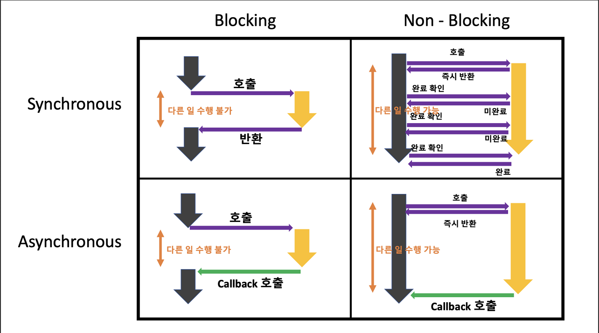

## 순차처리를 할지 말지가 핵심인 동기/비동기

### 동기
프로세스를 순차적으로 처리하는 것이다. 프로세스 순서가 A > B > A라고 가정한다면 B는 A가 완료된 후 실행되고 B가 완료되면 A를 실행한다.

### 비동기
프로세스를 순차적으로 실행하지 않고 처리하는 것이다. 비동기에서는 다음 프로세스가 완료될떄까지 기다리지 않고 실행된다.
따라서 완료 순서도 보장되지 않는다. A다음에 B가 실행되었더라도 B가 더 짧게 수행된다면 A보다 일찍 종료될 수 있다.

### Callback
A프로세스가 B프로세스의 완료여부를 알아야할 때는 어떻게 해야할까?
다른 작업의 완료 여부나 결과에 대한 후처리를 위해 이용되는 방식이 콜백 함수다.

A함수에서 B함수를 논블로킹 방식으로 실행하였을 경우 B함수가 끝났을 때만 처리되어야 하는 로직이 있을 경우 콜백 함수를 이용한다.

## 제어권이 핵심인 블로킹/논블로킹

### 블로킹
thread가 어떤 작업을 요청했을때 이 작업이 끝날때까지 대기 후 제어권을 반환받고 작업 수행가능

### 논블로킹
thread가 어떤 작업을 요청했을때 이 작업이 안끝나도 다른 작업을 할 수 있다. 제어권을 그대로 갖고 있기 때문

## 동기/비동기+블로킹/논블로킹

