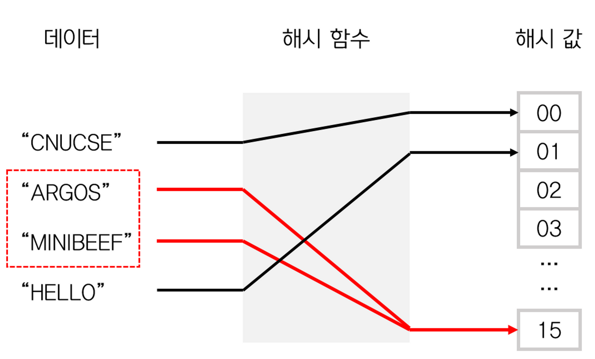
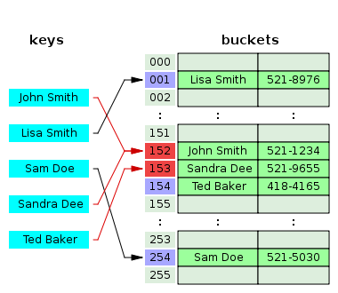
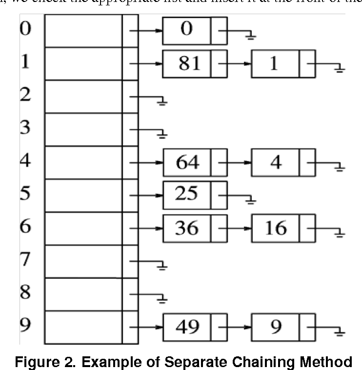

# 해시맵

## 해시란

- 해시 구조란 key-value 쌍으로 이루어진 데이터 구조다.
- key를 이용하여 value를 빠르게 찾을 수 있다는 장점이 있다.

## 해시 함수란
- 해시 함수란 임의 길이의 입력 값을 고정길이의 암호화된 출력으로 변환해주는 함수다.
- 해시 함수는 3가지 특징이 있다.
- 1. 어떤 입력 값에도 항상 고정된 길이의 해시값을 출력한다.
- 2. 입력 값의 아주 일부만 변경되도 전혀 다른 값을출력한다.
- 3. 출력된 결괏값을 통해 입력값을 유추할 수 없다.

## 해시 충돌이란

- 입력값이 다르더라도 값은 결괏값이 나오는 경우다.
- 해시 충돌은 항상 존재하며, 해시 충돌을 완화하는 방향으로 가야함.
- 해시 충돌이 적은 함수가 좋은 함수이다.
- 


## 해쉬 충돌 완화 방법

### 개방 주소법
한 버킷 당 들어갈 수 있는 엔트리는 하나이지만 해시 함수로 얻은 주소가 아닌, 다른 주소에 데이터를 저장할 수 있도록 하는 방법
 해시 충돌이 일어난 경우 다음 빈 버킷으로 들어가는 모습.

### 분리 연결법
분리 연결법은 개방 주소법 과는 달리 한 버킷 당 들어갈 수 이쓴ㄴ 엔트리의 수에 제한을 두지 않는다.
이때 버킷에는 링크드 리스트나 트리를 사용한다.


동일한 값들은 리스트로 연결되어 저장되어 있다.
따라서 해시 충돌이 일어나더라도 리스트로 노드가 연결되기 때문에 index가 변하지 않고 데이터 개수의 제약이 없다는 장점이 있다.
하지만 개방 주소법 방법과 비교했을 때, 추가적인 메모리 공간이 필요하며, 테이블의 적재율에 따라 성능이 저하된다.

따라서 적재율이 적을 경우 즉, 데이터가 적을 경우에는 개방 주소법 방식이 평균적으로 더 빠르다.

## Java에서 HashMap 동작방법

Java HashMap에서 사용하는 방식은 분리 연결법이다.
Java2부터 Java 7까지의 HashMap에서 분리 연결법 구현 코드는 조금씩 다르지만 구현 알고리즘 자체는 같았다.
하지만 Java 8부터 변경 되었는데, 이전까지는 분리 연결법에서 링크드 리스트를 고정적으로 사용했찌만
Java 8 이후부터는 데이터의 개수가 많아지면 트리를 사용하도록 변경되었다.

링크스 리스트를 사용했을 때는 조회에 대한 시간복잡도가 O(N/M) 이지만 트리를 사용하게 되면 O(log N/M)의 복잡도를 가지게 된다.
따라서 데이터의 개수가 일정 이상일 때에는 링크드 리스트 대신 트리를 사용하는 것이 성능상 이점을 가지게 된다.

하나의 해시 버킷에 할당된 키-값 쌍의 개수에 따라 링크스 리스트를 사용할 건지 트리를 사용할 건지 결정한다.

```static final int TREEIFY_THRESHOLD = 8;```

```static final int UNTREEIFY_THRESHOLD = 6;```

위 코드에 따라 Java 8 HashMap에서는 상수 형태로 기준을 정하고 있다.
즉 하나의 해시 버킷에 8개의 키-값 쌍이 모이면 링크드 리스트를 트리로 변경한다.

만약 해당 버킷에 있는 데이터를 삭제하여 개수가 6개에 이르면 다시 링크드 리스트로 변경하는데, 트리는
링크드 리스트보다 메모리 사용량이 많고, 데이터의 개수가 적을 때 트리와 링크드 리스트의 Worst Case 수행 시간 차이 비교는
의미가 없기 떄문.8과 6으로 2 이상의 차이를 둔 것은, 만약 차이가 1이라면 어떤 한 키-값 쌍이 반복되어
삽입/삭제 되는 경우 불필요하게 트리와 링크드 리스트를 변경하는 일이 반복되어 성능 저하가 발생할 수 있기 때문이다.
이때 사용하는 트리는 Red-Black Tree이다.

따라서 Java HashMap에서는 해시 충돌을 방지하기 위하여 분리 연결법을 사용하며, Java 8에서는
분리 연결법에서 링크드 리스트 대신 트리를 사용하기도 한다.


